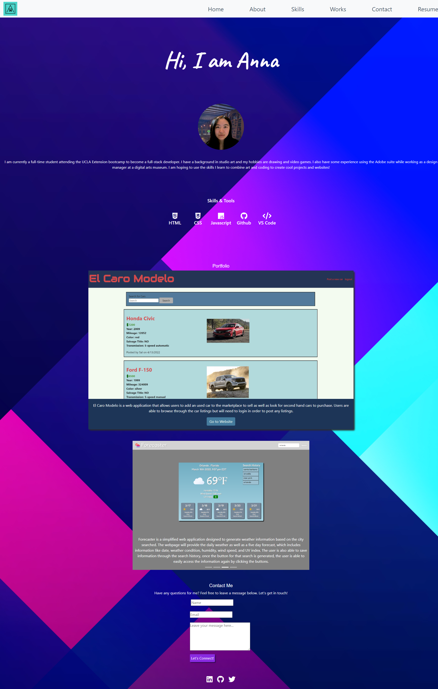

# Hello there!
I am a full-stack developer in the making! I am currently attending the UCLA Extension bootcamp, learning how to make cool and amazing websites. 

## My Portfolio

My first big project "The Grand Line Anime" was created for anime lovers, it encompasses a lot of functions that myself, as someone who thoroughly enjoys anime, would appreciate. The web application uses APIs to generate the information and other features were also added to enhance user experience. 

A more recent project that I collaborated with others is El Caro Modelo, which is a marketplace website for users to sell and buy used cars. Users are able to browse through the car listings which contains information such as a picture of the car, make, model, mileage, salvage title, etc. There is also a search function that is currently able to pull out car listing based on make and model. If the user wants to add a car, they must be logged into an account in order to do so.

I also worked on a tech blog website that allows users to make, update, and delete posts. Users are also able to add comments to posts they see. This project focuses mainly on the backend with the database and MVC. 

The other two projects were built to be simple. The weather dashboard is able to pull a lot of useful information while also maintaining its simplicity for navigation and use. The Code Quiz was a beginning project that only uses HTML, CSS, and Javascript. 

## About Me

My name is Anna Cheng and I am a coding student currently taking online classes. I am an UCR alumni who studied in studio art. My favorite coding language right now is Javascript because it is both fun and challenging. 

### Links

Github Link: https://github.com/ycheng2021/Anna-Professional-Portfolio

Deployed Link: https://ycheng2021.github.io/Anna-Professional-Portfolio/

